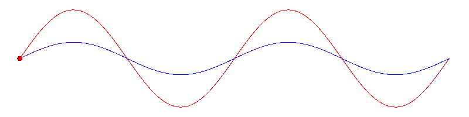
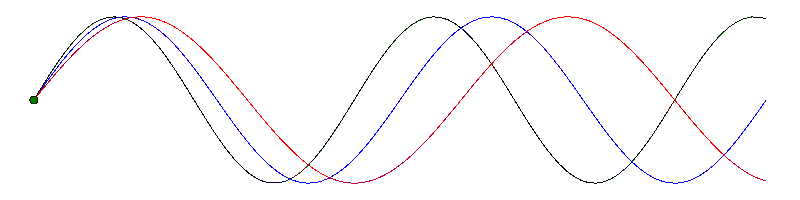
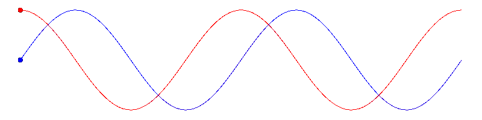
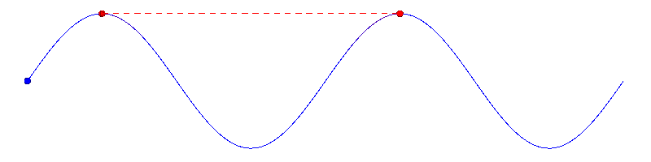

```{r setup, include=FALSE}
knitr::opts_chunk$set(
	echo = FALSE,
	message = FALSE,
	warning = FALSE,
	cache = TRUE
)
library(rorcid)
library(tibble)
library(dplyr)
library(rcrossref)
library(knitr)
```

<br><br>

#  {.tabset .tabset-fade}

## About me

### Hi.

<br><br>
<div class="myin">
Thanks for your interest. I am a molecular & computational biologist trained in the preparation and analysis of RNA-seq, ChIP-seq, DAP-seq, ATAC-seq, and GWA datasets. I am passionate about learning and staying up to date with the literature. I have a proven performance history of competent, publication worthy analyses in several different sequencing related disciplines.
</div>
<br>
- Kirk
<br><br><br>

{}

## Publications

```{r, results = FALSE}

test <- works("0000-0001-9698-3985")
dois <- rorcid::identifiers(test)
fullpubs <- rcrossref::cr_works(dois = dois)
fullpubs <- fullpubs$data
pubsdf <- data.frame(title = fullpubs$title, 
                     author = unlist(sapply(fullpubs$author, function(x) paste(x$given, x$family, collapse = ", "))), 
                     year = fullpubs$issued, 
                     journal = fullpubs$container.title, 
                     doi = paste0("https://doi.org/", fullpubs$doi))
pubsdf$year <- sub("-.*", "", pubsdf$year)
pubsdf$title <- gsub("\n", "", pubsdf$title)
pubsdf$author <- gsub("Kirk J.-M. MacKinnon", "<b> Kirk J.-M. MacKinnon </b>", pubsdf$author)
pubsdf$author <- gsub("Kirk J‐M. MacKinnon", "<b> Kirk J-M. MacKinnon </b>", pubsdf$author)
pubsdf$title <- gsub("Brachypodium distachyon", "<i> Brachypodium distachyon </i>", pubsdf$title)
pubsdf <- arrange(pubsdf, desc(year))
```

```{r, results = "asis"}

for (pubs in 1:nrow(pubsdf)) {
  cat(
    "<b>",
    pubsdf[pubs, "year"],
    "</b>",
    "\t",
    pubsdf[pubs, "journal"],
    "\n\n",
    "<b>",
    pubsdf[pubs, "title"],
    "</b>",
    "\n\n",
    pubsdf[pubs, "author"],
    "\n\n",
    pubsdf[pubs, "doi"],
    "\n\n\n",
    "<hr>",
    "\n\n"
  )
  
}


```





## Shiny apps

<br>

```{r, results = "asis"}

tribble(
  ~url, ~desc, ~image,
  "https://hazenlab.shinyapps.io/shinyapp/", "Timecourse RNA-seq", "tcthumbnail.png",
  "https://hazenlab.shinyapps.io/swiztc/", "Touch Responsive Timecourse RNA-seq", "swiztcthumbnail.png",  
  "https://hazenlab.shinyapps.io/snd2r/", "Gain and loss of function RNA-seq", "snd2rthumbnail.png"
) -> sites
sites <- as.data.frame(sites)


for (lines in 1:nrow(sites)) {
  cat(
    "<b>", 
    sites[lines, "desc"], 
    "</b>", 
    
    "\n\n",
    
    "<div class='myin'>",
    "<p>",
    "[{width=250}](",
    sites[lines,"url"],
    
    ")",
    
    "\n\n",
    "<div class='myin'>",
    sites[lines, "url"], 
    "</p>",
    "</div>",
    "</div>",
    "<hr>", 
    "\n\n")
}
```





## CV

{width="100%" height="1000"}

